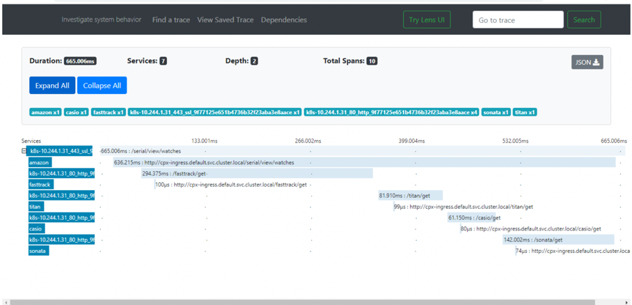
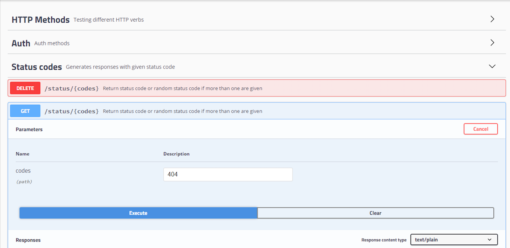
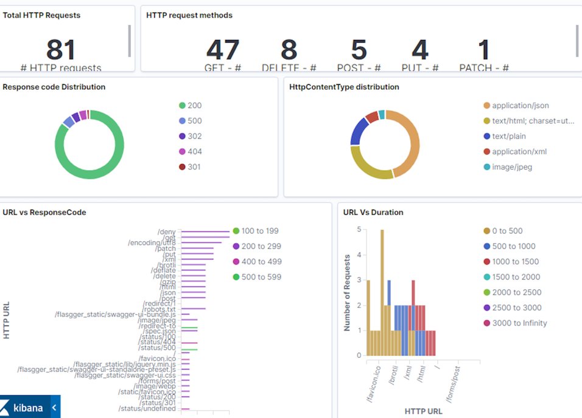

# Deploy Citrix Observability Exporter

This topic provides information on how to deploy Citrix Observability Exporter using Kubernetes YAML files.
<!---
You can deploy Citrix Observability Exporter using Kubernetes YAML files. 
-->

Based on your Citrix ADC deployment, you can use Citrix Observability Exporter to export metrics and transactions from Citrix ADC CPX, MPX, or VPX.

The following diagram shows a deployment of Citrix Observability Exporter with all the supported endpoints.

## Prerequisites

 - Ensure that you have a Kubernetes cluster with  `kube-dns` addon enabled.
 - If Zipkin is used as the distributed tracer,
   ensure that you have the following docker images installed in the Kubernetes cluster:
    - [Zipkin](https://zipkin.io/)
    - (Optional) [Elasticsearch](https://www.elastic.co/products/elasticsearch) as back-end for Zipkin. Elasticsearch is required if you want to visualize your tracing data in [Kibana](https://www.elastic.co/products/kibana). You can also use Elasticsearch as an endpoint for transactions.
    - (Optional) [Kibana](https://www.elastic.co/products/kibana) is required to visualize your tracing data.

    **Note:**
    You can use [zipkin.yaml](../examples/zipkin.yaml), [elasticsearch.yaml](../examples/elasticsearch.yaml), and [kibana.yaml](../examples/kibana.yaml) for installing Zipkin, Elasticsearch, and Kibana.

- If Elasticsearch is used as the endpoint for transactions, ensure that you have Elasticsearch installed and configured.
- If Kafka is used as the endpoint for transactions, ensure that Kafka server is installed and configured.

## Deploy Citrix Observability Exporter using YAML

To deploy Citrix Observability Exporter using Kubernetes YAML, perform the following steps for the required endpoint:

1. Create a secret using the certificate [ingress.crt](../examples/ingress.crt) and key [ingress.key](../examples/ingress.key) provided. You can also use your own certificate and key.

        kubectl create secret tls ing --cert=ingress.crt --key=ingress.key

2. If you use Citrix ADC VPX or MPX in the deployment, create the necessary login credentials.

        kubectl create secret  generic nslogin --from-literal=username='nsroot' --from-literal=password='nsroot'

3. Create a Kubernetes ConfigMap, Deployment, and Service with Log stream configuration for the required endpoint:

   - For Citrix Observability Exporter with Zipkin tracing support:

     Deploy Citrix Observability Exporter using the [coe-tracing.yaml](coe-tracing.yaml) file.

         kubectl create -f  coe-tracing.yaml

     Set the `EnableTracing` option to `yes` and provide the Zipkin server information using `TracingServer`.
     You can specify the tracing server in ConfigMap using environment variables in two ways:

     - Specify the IP address or DNS name of the tracing server (Zipkin):

                TRACING_SERVER=<ip-address> or <dns-name>

       If you specify only the IP address, Citrix Observability Exporter considers the port as the default Zipkin port (9411) and takes the default upload path (`/api/v1/spans`).

     - Explicitly provide the tracer IP address or DNS name, port, and the upload path information:
       
                TRACING_SERVER=<ip-address>:<port>/api/v1/spans

- For Citrix Observability Exporter with Elasticsearch as the endpoint:

     Deploy Citrix Observability Exporter using the [coe-es.yaml](coe-es.yaml) file.
   
      kubectl create -f coe-es.yaml

     Set the Elasticsearch server details in the `ELKServer` environment variable either based on IP address or DNS name, along with port information.

- For Citrix Observability Exporter with Kafka as the endpoint:

   Deploy Citrix Observability Exporter using the [coe-kafka.yaml](coe-kafka.yaml) file
   
      kubectl create -f coe-kafka.yaml

   Enable the Kafka endpoint by setting the value of `EnableKafka` as `yes`. Also, set Kafka broker details in `KafkaBroker` and topic details in `KafkaTopic`. You also must specify the Kafka cluster host IP mapping under HostAliases in the [Kubernetes Pod specification](https://kubernetes.io/docs/concepts/services-networking/add-entries-to-pod-etc-hosts-with-host-aliases/#adding-additional-entries-with-hostaliases).

   **Note:**
   Once you deploy a Citrix Observability Exporter instance with a specific endpoint, you cannot modify it. For changing the endpoint, you must bring down the Citrix Observability Exporter instance and deploy it again with the new endpoint.

## Configure Citrix Observability Exporter support on Citrix ADC

Once you deploy Citrix Observability Exporter, you need to deploy the Citrix ADC appliance. You can either deploy Citrix ADC CPXs as pods inside the Kubernetes cluster or deploy a Citrix ADC MPX or VPX appliance outside the cluster.

### Deploy Citrix ADC CPX with Citrix Observability Exporter Support

In this procedure, a Citrix ADC CPX is deployed with the Citrix ingress controller as a sidecar. The Citrix ADC CPX instance load balances the North-South traffic to microservices in your Kubernetes cluster.

Depending on the endpoint you are using, you can choose the YAML file for deploying Citrix ADC CPX. These YAML files include the configuration required for Citrix Observability Exporter.

**Note:**
  Any usage of the environment variable ``NS_LOGPROXY`` in this procedure refers to ``Citrix Observability Exporter`` only.

Perform the following steps to deploy a Citrix ADC CPX instance with Citrix Observability Exporter support enabled.

1. Download the YAML file for deploying Citrix ADC CPX according to the endpoint.

    - For tracing support with Zipkin:  [cpx-ingress-tracing.yaml](../examples/tracing/cpx-ingress-tracing.yaml)
    - For Elasticsearch as the transaction endpoint: [cpx-ingress-es.yaml](../examples/elasticsearch/cpx-ingress-es.yaml)
    - For Kafka as the transaction endpoint: [cpx-ingress-kafka.yaml](../examples/kafka/cpx-ingress-kafka.yaml)

2. Edit the YAML file and specify the environment variables in the Citrix ingress controller configuration according to the endpoint you are using:

    - For tracing support with Zipkin:
  
                -name: "NS_LOGPROXY"
                 value: "<abc.com>"
                -name: "NS_DISTRIBUTED_TRACING"
                 value: "yes"

    - For Elasticsearch or Kafka as the transaction endpoint:
  

                - name: "NS_LOGPROXY"
                 value: "<abc.com>"
        
        
        **Note:**
        Using [smart annotations](https://developer-docs.citrix.com/projects/citrix-k8s-ingress-controller/en/latest/configure/annotations/), you can define specific parameters you must import by specifying it in the YAML file for deploying Citrix ADC CPX.

        For example:

        
                ingress.citrix.com/analyticsprofile: '{"webinsight": {"httpurl":"ENABLED", "httpuseragent":"ENABLED", "httphost":"ENABLED", "httpmethod":"ENABLED", "httpcontenttype":"ENABLED"}, "tcpinsight": {"tcpBurstReporting":"DISABLED"}}'
  

        
        **Note:**
        You can also define the parameters to import using smart annotations for service. You can specify the parameters in the YAML for deploying Citrix Observability Exporter. However, you can use service annotations only when the service type is `LoadBalancer`.

        For example:
        
                service.citrix.com/analyticsprofile: '{"<service name>":'{"webinsight": {"httpurl":"ENABLED", "httpuseragent":"ENABLED"}
        

3. Deploy Citrix ADC CPX with the Citrix ingress controller as a sidecar using the following command.

    - For tracing support with Zipkin:

                kubectl create -f cpx-ingress-tracing.yaml 
    
    - For Elasticsearch as the transaction endpoint:
        
                 kubectl create -f cpx-ingress-es.yaml 
    
    - For Kafka as the transaction endpoint:

                 kubectl create -f cpx-ingress-kafka.yaml 

### Deploy the Citrix ingress controller with Citrix Observability Exporter support for Citrix ADC MPX or VPX

 In this deployment, the Citrix ingress controller is deployed as a standalone pod in the Kubernetes cluster. It controls the Citrix ADC MPX or VPX appliance deployed outside the cluster. The Citrix Observability Exporter support is enabled in the Citrix ingress controller configuration.

 Perform the following steps to deploy the Citrix ingress controller as a pod in the Kubernetes cluster with Citrix Observability Exporter support enabled.

You need to complete the [prerequisites](https://developer-docs.citrix.com/projects/citrix-k8s-ingress-controller/en/latest/deploy/deploy-cic-yaml/#prerequisites) for deploying the Citrix ingress controller as a standalone pod.

1. Download the [vpx-ingress.yaml](../examples/vpx-ingress.yaml) file.

2. Edit the `vpx-ingress.yaml` file and modify the values for the environmental variables as provided in [deploying the Citrix ingress controller](https://developer-docs.citrix.com/projects/citrix-k8s-ingress-controller/en/latest/deploy/deploy-cic-yaml/#deploy-citrix-ingress-controller-as-a-pod).

3. Specify environment variables for Citrix Observability Exporter in the Citrix ingress controller configuration.

   - For tracing support with Zipkin:
  

                - name: "NS_LOGPROXY"
                  value: "<abc.com>"
                - name: "NS_DISTRIBUTED_TRACING"
                  value: "yes"

   - For ElasticSearch or Kafka as the transaction endpoint:
  

                - name: "NS_LOGPROXY"
                  value: "<abc.com>:5557"

4. Once you update the environment variables, save the [vpx-ingress.yaml](../examples/vpx-ingress.yaml) file and deploy it using the following command.

        kubectl create -f vpx-ingress.yaml -n tracing

## Deploy sample applications

 Once you create the necessary secrets, Citrix ADC deployment, and Citrix Observability Exporter, you can test the Citrix Observability Exporter deployment with a sample application.

### Verify Citrix Observability Exporter tracing support

This example shows how to verify the Citrix Observability Exporter deployment and distributed tracing using a sample application. In this example, a Citrix ADC CPX instance is deployed with Citrix Observability Exporter support enabled.

1. Deploy a sample web application using the [watches-app-tracing.yaml](../examples/tracing/watches-app-tracing.yaml)
file. This file includes the deployment, service, and Ingress.

        kubectl create -f watches-app-tracing.yaml  

1. Send a request to the application using the following command.
    
        kubectl run -i --tty busybox --image=busybox --restart=Never --rm -- wget --no-check-certificate "https://cpx-ingress.default.svc.cluster.local/serial/view/watches"

2. Open the Zipkin user interface using the IP address and port specified during installation.
   
        http://<ip-address>:9411/

    You can see the traces as shown in the following image.

    

    This image shows a trace created for a request in Zipkin. You can see that multiple microservices are invoked to serve a single request and spans for each microservice is created. The time taken to process a request on each microservice is displayed. Spans starting with `k8s_*` are created for Citrix ADC CPX and other spans are for back end web servers.

### Verify Citrix Observability Exporter transaction support

This example shows how to verify a Citrix Observability Exporter deployment with Elasticsearch as the transaction endpoint.

You must complete the following steps before performing the steps in this example:

- Deploy Citrix Observability Exporter with Elasticsearch as the transaction endpoint.
- Deploy Citrix ADC CPX with Citrix Observability Exporter support enabled

Once you deploy Citrix Observability Exporter and Citrix ADC CPX perform the following steps:

1. Deploy a sample web application using the [webserver-es.yaml](../examples/elasticsearch/webserver-es.yaml)
file. This sample web application is added as a service in the Ingress.

        kubectl create -f webserver-es.yaml  

1. Create a host entry for the web application in Citrix ADC CPX hosts file and map it to the IP address of Kubernetes master node for DNS resolution.

        www.samplewebserver.com ip-address

1. Get `NodePort` information for `cpx-service` using the following command.

        kubectl describe service cpx-service

2. Access `http://www.samplewebserver.com:NodePort` from a web browser to open the sample web application.

3.  Send multiple requests to the application as shown in the following sample image.

    

    **Note:**
          You can generate different types of response status codes for different HTTP methods (for example, GET, POST, DELETE, and so on).

1. All transactions are uploaded to the Elasticsearch server and you can view them using the Kibana dashboard. 

   You can use the following sample Kibana dashboard to visualize transactions.

   

   **Note:**
   You can import the Kibana dashboard template from [dashboards](./dashboards/KibanaAppTrans.ndjson).
   Before importing the Kibana dashboard, you must define an index pattern named `*http*` using the information in the [Kibana User Guide](https://www.elastic.co/guide/en/kibana/current/tutorial-define-index.html).
